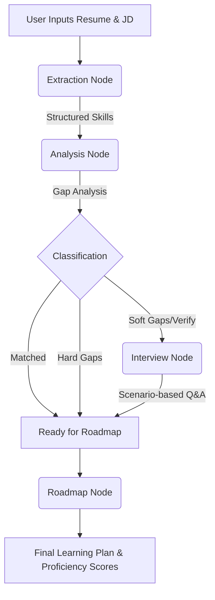

# Catalyst Agent: AI-Powered Skill Assessment & Learning Roadmap

**Catalyst Agent** is an advanced AI career companion built for the Catalyst Hackathon. It moves beyond static resumes by using a stateful **LangGraph** workflow to conversationally validate a candidate's skills against a Job Description, identifying real proficiency gaps and generating a personalized learning roadmap.

## 🚀 Key Features
- **Stateful Skill Validation**: Uses a Python-based **LangGraph** engine to manage complex multi-step reasoning.
- **Conversational Verification**: A dynamic chat interface that asks technical questions to verify the depth of a candidate's experience.
- **Automated Gap Analysis**: Compares JD requirements against Resume skills to find "Hard Gaps" (missing) and "Soft Gaps" (unverified).
- **Dynamic Roadmaps**: Generates a week-by-week learning plan with curated YouTube/Course resources.
- **Llama 3.3 Intelligence**: Powered by **Llama 3.3 (70B)** via Groq for sub-second, high-reasoning logic.

## 🛠️ Tech Stack
- **Frontend**: Next.js 15 (React, Tailwind, Framer Motion)
- **Backend**: FastAPI (Python)
- **AI Orchestration**: LangGraph & LangChain
- **LLM**: Llama 3.3 70B (via Groq LPUs)
- **PDF Extraction**: PyPDF2 (Python)

---

## ⚙️ Local Setup

To run this project, you will need to start both the **Backend** and the **Frontend** servers.

### 1. Environment Variables
You need a **Groq API Key** (available at [console.groq.com](https://console.groq.com)).

Create a `.env` file in the `backend/` directory:
```env
GROQ_API_KEY=your_gsk_key_here
```

### 2. Start the Backend (Python)
```bash
cd backend
pip install -r requirements.txt
python main.py
```
*Server will be running at `http://localhost:8000`*

### 3. Start the Frontend (Next.js)
Open a new terminal:
```bash
# In the root directory
npm install
npm run dev
```
*UI will be available at `http://localhost:3000`*

---

## 🏗️ Architecture & Logic
The agent follows a multi-node workflow:



### 🧠 Scoring & Logic Workflow

1. **Skill Classification Logic**
   We use LLMs to categorize skills into three buckets:
   - **Matched**: High confidence skills explicitly backed by project descriptions or years of experience.
   - **Gaps**: Essential Job Description (JD) requirements missing from the resume.
   - **Verify**: Mentioned skills that lack context (e.g., "Python" mentioned in skills but no Python projects listed).

2. **Conversational Verification**
   Instead of a simple "yes/no", the agent generates **scenario-based questions**. 
   *Example:* If a candidate claims "React Query", the agent might ask: *"How would you handle a race condition where multiple components trigger the same query on mount?"*

3. **Proficiency Calculation**
   The Proficiency Score (0-100) is calculated based on:
   - **Original Context**: How prominently the skill features in the resume.
   - **Interview Response**: The technical depth and correctness of the user's answer during the chat phase.

4. **Roadmap Generation**
   The "Adjacent Skills" logic identifies technologies that are naturally related to the candidate's existing stack but required for the target role, ensuring the learning path is **realistic and achievable**.

## 🎥 Submission Details
- **Demo Video**: [[Insert Link Here](https://drive.google.com/file/d/1XS4ZpKBSaF_IRHCtpo6l2ztEObHszUyv/view?usp=drive_link)]
- **Project URL**: [Insert Deployed URL Here]
- **GitHub**: [(https://github.com/rajstats2010-dev/DeccanAI)]

---
Built for the **Catalyst Hackathon** by **Raju Kommarajula**.
